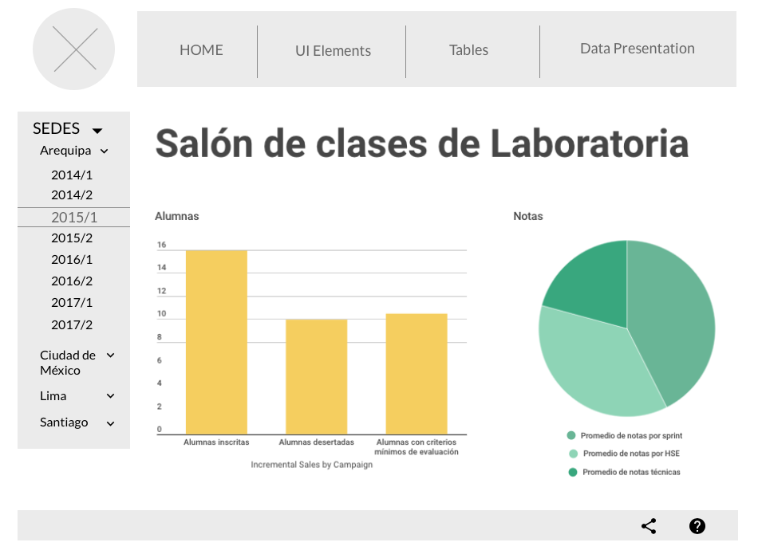

#RETOS UNIDAD 3: INTRO A USER EXPERIENCE DESIGN

## 1. Explica qué partes conforman el UX y qué partes el UI de la página Laboratoria

UX: Es el proceso creativo y analítico para determinar qué y cómo será una web, teniendo en cuenta las necesidades, deseos y metas de los usuarios. Es lo que te hace sentir un producto al momento de interactuar con el. Teniendo en cuenta esta definición y en mi propia experiencia, puedo decir que las partes que conforman la UX de la página de Laboratoria, son:

- Contacto visual
Ese primer encuentro al momento de abrir la página y encontrar una imagen de una mujer, teniendo el contexto de que es un programa dirigido sólo para mujeres, ya con el hecho de ver la imagen con un rostro femenino, asegura que es coherente la información previa.

- Contenido de información
Los títulos son cortos pero con un gran mensaje, así mismo con los párrafos, dicen sólo lo que es necesario transmitir para que la usuaria se sienta idenificada y quiera saber más sobre Laboratoria, pero sin saturarla de contenido informativo, lo cual hace que siga bajando el scroll para conocer más y una vez que ha leído acerca de qué es y quiénes conforman Laboratoria, la usuaria decidirá a cuál de los dos botones principales va a acceder.
Al momento de entrar al botón de "Estudiantes", encontrará más información y también se encontrará con un nuevo botón para postular, este botón no dejará de aparecer mientras siga bajando el scroll y una vez que llegue al final de esta página, se encontrará por fin el formulario al que aún no se decidía acceder, con la finalidad de que una vez que ya leyó todo sobre Laboratoria, acceda a ingresar sus datos y enviarlos.

- Accediendo al botón objetivo de Laboratoria
Una vez que ha ingresado a esta ventana para postulars, se encontrará con un formularios, que tendrá que llenar con datos básicos, y posteriormente, unas preguntas para saber si ha leído la información y de esta manera se sienta segura de que ha entendido bien de qué trata el programa y entonces sí, postular. Lo último que encontrará la usuaria será una sección de preguntas frecuentes, para que en todo caso de tener todavía dudas sobre lo que es y hace Laboratoria, pueda recurrir a estas preguntas con respuestas y aclarar esas dudas.

UI:
De acuerdo al significado que tiene UI (Interfaz del Usuario), es la vista que permite al usuario interactuar de manera efectiva con un sistema, es la suma de la arquitectura de información, más elementos visuales, más patrones de interacción, por lo tanto considero que las partes que conforman la UI de la página de Laboratoria, son los siguientes:

- Arquitectura de Información. 
Primero se muestra el logo de Laboratoria, y junto a este, dos botones principales, debajo una imagen que haga esa conexión inspiradora entre lo que Laboratoria quiere transmitir y lo que, en este caso la usuaria,necesita sentir, más abajo hay más información acerca de lo que es Laboratoria en general, con datos importantes pero sin saturar de información. En cada una de las secciones de información hay botones para acceder a otras ventanas informativas, para que la usuaria conozca más, o bien si se ha decidido a postular, lo haga por este medio. Las otras dos ventanas, que son las de los botones principales, ubicados en la cabezera junto al logo, tienen practicamente la misma estructura, pero con información especificamente dirigida a las posibles estudiantes, para que se decidan a postular, que es el objetivo principal del negocio.

- Elementos Visuales (Colores, Imágenes, Tipografía).
Los colotes que usa son los principales que identifican a Laboratoria, el amarillo principalmente, blanco y negro para el caso del background y la tipografía y un gris para complementar este matiz de blanco y negro. 
Las imágenes son de mujeres, pues es el público al que va dirigido el programa, y sobre todo fotografías de mujeres que reflejan esa felicidad de lo que han logrado estando en Laboratoria.
La tipografía es totalmente legible, usando principalmente dos variantes, que son bold y normal, y sólo en las imágenes se utiliza en mayor tamaño, para mostrar precisamente ese mensaje motivacional.

- Patrones de interacción.
La interacción que la usuaria tiene con el sitio, son: los dos botones principales, que las lleva a otra página con otra información adicional, el formulario en el cual si es el caso de que decidan postular, registren sus datos y los envíen, así como los botones con los iconos de sus redes sociales, que la llevará a dirigirse a las mismas, y por último el chat que al igual que los iconos de las redes sociales, se encuentra siempre presente, disponible para cuando así lo requiera la usuaria.

Todo esto en conjunto, hacen que la Interfaz del Usuario tengan o no exito en el negocio, ya que de hacerlo correctamente, y lograr esa conexión entre la usuaria y el sitio, habrá como respuesta lo que el negocio necesita, que son las postulantes.

CONCLUSIÓN: La relación entre UX y UI son definitvamente unidas una con la otra, puesto que si no hubiera alguna de las dos, el mensaje que se quiere transmitir y sobre todo el objetivo al que se quiere llegar, no tendría el mismo caso de éxito, pues si por ejemplo, no se implementara el UX, toda la información estaría distribuida posiblemente en una sola sección, o en muchas, a las que la usuaria en este caso, no entraría para evitar tener que dar tantos clicks o simplemente acceder a una y otra y otra ventana; y si en el caso fuera que no se implementara la UI, visualmente no llamaría la atención y no tendria esa estructura que hace la lectura más legible y accesible, tanto por las formas estructuradas del diseño, como por los colores y la amabilidad de acceder a cada ventana o sección.

## 2. Identifica los elementos de navegación en la página GitHub

Los elementos de navegación son los que llevan al usuario de un punta "A" a un punto "B", en donde buscamos elementos conocidos o no, exploramos y accedemos otros elementos, hay siete tipos de navegación:

- Global, la navegación principal del sitio.
- Local, navegación localizada a una página o vista.
- Facetada, navegación a través de filtros.
- Filtrada, navegacion basada en los resultados de búsqueda, dando una serie de opciones de filtros de acuerdo a esa búsqueda.
- Contextual, navegación acorde con el contexto en el que está navegando el usuario.
- Inline, son links de referencia utilizados en artículos.
- Sumplementaria, nvegación adicional, a veces temporal, para señalar funciones a nuevos usuarios.

En GitHub podemos encontrar que cuenta con los siguientes elementos:

Global, pues tiene un menú al cual el usuario puede acceder en la parte posterior de la página.

Local, ya que permite al usuario ver en qué parte de la página se encuentra localizado, al tener señalado con un distintivo la barra del menú en la que se encuentra.

Contextual, ya que en algunas secciones de la página, el usario puede encontrar enlaces con el tema realcionado al que está visualizando en ese momento.

Inline, pues contiene links de referencia en varias secciones de la página, que llevan al usuario a otras partes de la misma página de GitHub.

CONCLUSIÓN: Podemos darnos cuenta que es una página diseñada para que el usuario pueda interactur en el sitio de varias maneras posibles, al tener estos principales tipos de navegación, pensda para que la experiencia del usuario sea la mejor, y pueda sentir un trayecto fácil de transitar entre cada punto de la página. Al ser una página con muchos enlaces, puede ser complicado para el usuario volver a encontrar el camino, sin embargo gracias a la construcción de una estructura adecuada, en GitHub no tendría este tipo de problema el usuario.

## 3. Crea un sketch para la herramienta del dashboard de Laboratoria

El dashboard es una herramienta utilizada por profesores, training managers, directores y gerentes de Laboratoria para ver rápidamente qué está pasando en el salón de clases de Laboratoria. En el dashboard, los usuarios mencionados pueden ver rápidamente estadísticas y datos en tiempo real como:

No. de alumnas inscritas
No. de alumnas que desertaron
No. y % de alumnas que pasan el criterio mínimo de evaluación
Promedio de notas por sprint
Promedio de notas HSE
Promedio de notas técnicas
Además, dado que Laboratoria tiene muchas generaciones, regularmente 2 generaciones por año (estas generaciones empezaron en el 2014), y que opera en 4 sedes (Arequipa, Ciudad de México, Lima y Santiago de Chile), es posible que los usuarios quieran ver datos de sedes / generaciones anteriores para poder hacer comparaciones.

Haz un sketch del dashboard de Laboratoria.

-Ten en cuenta los elementos de navegación en tus sketches.
-Utiliza títulos y textos reales.

Se incluye imagen del sketch

 